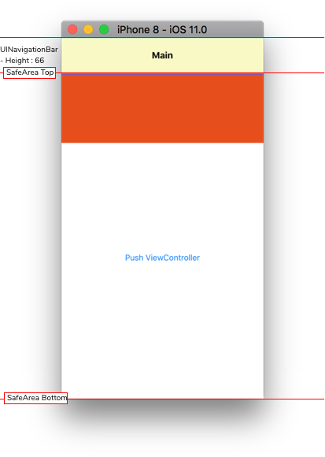
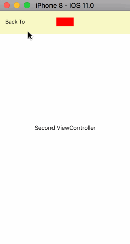

# Custom-UIKit

Easy to customize all of the iOS UIKit :smile:

I want to share my swift recipe for `how to customize UIKit?`

Custom-UIKit is not a CocoaPod Library. It's a sample code. You can copy and paste into your project.

I'm going to add all of iOS UIKit.

Please let me know If you want to customize UIKit.

## [Custom-UIKit-NavigationBar](https://github.com/ShawnBaek/Custom-UIKit-NavigationBar)

Enable to set UINavigationBar's height.

## Todo List

- [x] UINavigationBar
- [ ] UIPickerView
